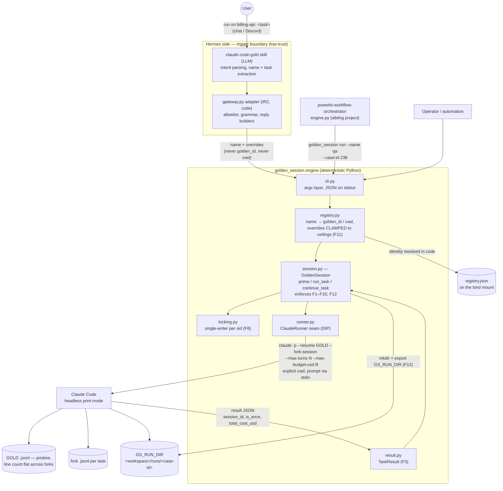
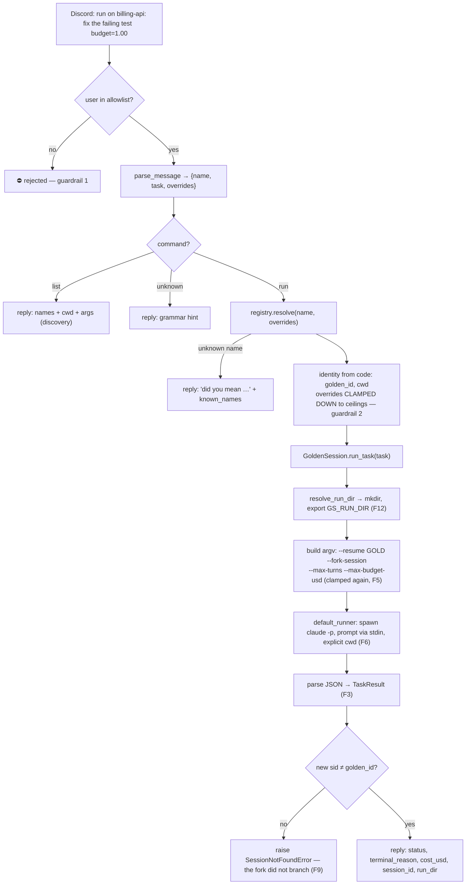
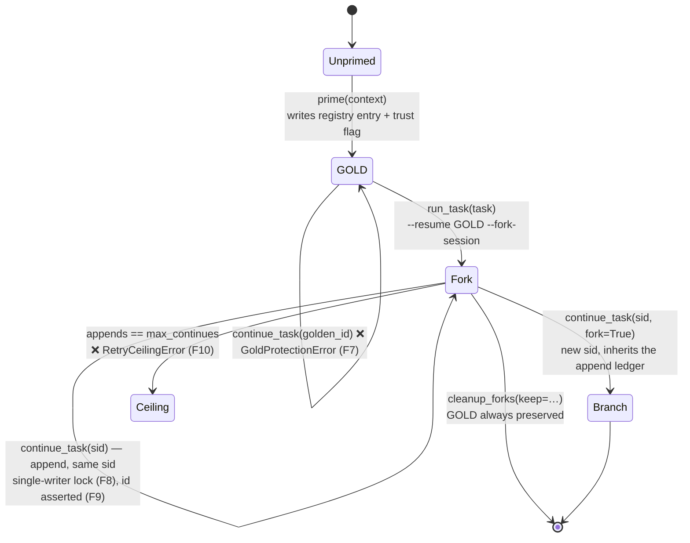
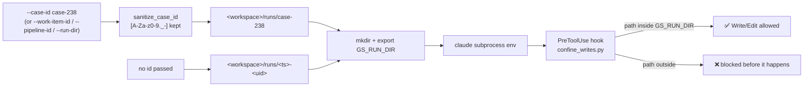
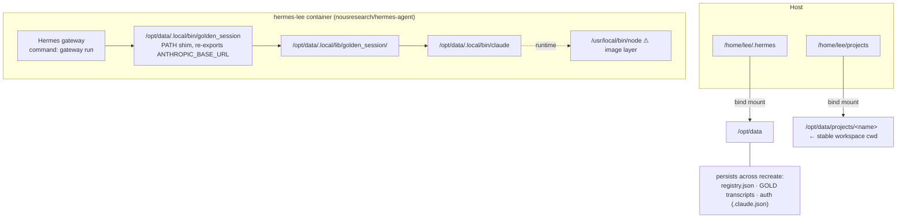
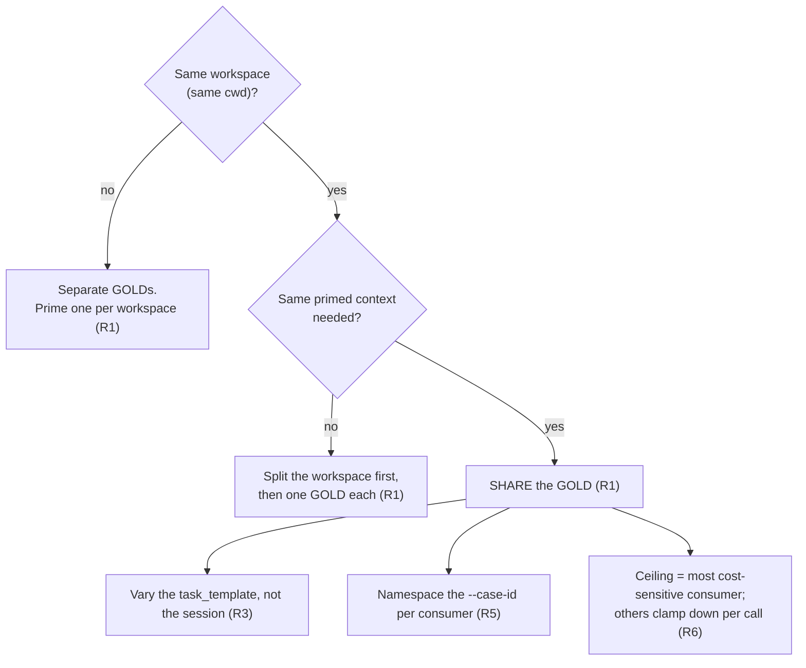

# Project Overview — sub-agents-on-hermes

> Entry point for the `docs/prd/` set. This document answers *what the system is,
> how the pieces fit, and what happens on a run*. The sibling docs go deeper:
> [`01-considered-approaches.md`](./01-considered-approaches.md) (why headless CLI),
> [`02-gold-session-management.md`](./02-gold-session-management.md) (the GOLD pattern + CLI gotchas),
> [`03-open-threads.md`](./03-open-threads.md) (deferred work),
> [`04-phase1-mvp-prd.md`](./04-phase1-mvp-prd.md) (the Phase 1 contract F1–F11),
> [`05-integration-and-deployment.md`](./05-integration-and-deployment.md) (wiring + runbook).

## 1. What this project is

A [Hermes](https://nousresearch.com) agent runs in Docker and orchestrates Claude Code
**GOLD sessions**. `golden_session` — a zero-dependency, stdlib-only Python engine — drives
the headless `claude -p` CLI with one pattern:

```
prime once  →  fork per task  →  resume to recover
```

The point is **not** features. It is that the orchestration invariants are **enforced in
code, never improvised by an LLM** (Decision A2). An agent left to drive `claude -p` itself
will eventually `--resume` onto GOLD, drop the explicit `cwd`, or skip a budget cap — each
of which fails *silently and looks like success*.

| Concern | Owner |
|---|---|
| Natural-language parsing, "which session, which task" | the **agent** (flexible) |
| Identity (`golden_id`, `cwd`), caps, locking, fail-loud | **code** (`golden_session`) |

### The three roles

```
trigger  →  engine  →  substrate
```

| Layer | What it is | Where |
|---|---|---|
| **Trigger** | Discord IM, the `claude-code-gold` skill, or a direct CLI call | `gateway.py`, `skills/`, `bin/golden_session` |
| **Engine** | `GoldenSession` + `Registry` — enforces F1–F12 deterministically | `golden_session/` |
| **Substrate** | `claude -p --output-format json` (headless print mode) | the `claude` CLI, v2.1.x |

## 2. Architecture overview

The system has two layers with a strict division of labor:

- **Hermes Agent (LLM layer)** — parses natural language, picks the session *name* and
  phrases the task, relays the result back to the channel. It never resolves identity, never
  sets a cap, and never calls `claude -p` itself.
- **`golden_session` engine (deterministic Python layer)** — resolves the name to
  `{golden_id, cwd}`, clamps every cap, serialises writes, asserts session ids, and owns the
  subprocess. It never makes a "creative" decision.

This is Decision A2 (doc 05): invariants belong in code, not in a prompt. An LLM improvising
`terminal("claude -p …")` calls will eventually resume onto GOLD, drop the explicit `cwd`,
or skip a budget cap — each of which fails silently and looks like success.  
Here is an use case: "a Discord user asks to run a task against the GOLD session registered under the name billing-api." 



Key relationships:

1. **Agent → engine**: the agent hands over a *name* and a task string. Identity
   (`golden_id`, `cwd`) is never supplied by the caller — the registry resolves it in code,
   which is what preserves F6/F7 at a low-trust chat boundary.
2. **Engine → `claude -p`**: nothing above `runner.py` touches `subprocess`. Every task is
   `--resume GOLD --fork-session`, so GOLD is read but never written; caps are re-clamped
   inside `_build_args` even if a caller asked for more.
3. **Two clamps, one direction**: overrides pass `Registry.clamp` (against the session's
   `ceilings`) and then the constructor caps. Both clamp *down* only — a chat user cannot
   widen a budget, and neither can a buggy orchestrator.
4. **All tasks → `GS_RUN_DIR`**: the run directory is the data channel. It is always set,
   and a cwd-level PreToolUse hook confines `Write`/`Edit` to it, so output isolation is
   enforced rather than merely instructed (F12).
5. **Orchestrator → engine**: the Power BI workflow orchestrator is a *consumer* of this
   CLI, not a peer. It passes only `--name` and `--case-id`; session identity, workspace
   resolution, and `GS_RUN_DIR` construction stay here. That contract is why `--case-id` /
   `--work-item-id` / `--pipeline-id` exist — every node of a DAG that shares an id shares
   one directory.

### Module responsibilities (one line each — SRP)

| Module | Single responsibility |
|---|---|
| `session.py` | The GOLD contract: prime once, fork per task, resume to recover. Holds F1–F10, F12. |
| `registry.py` | Name → `{golden_id, cwd, defaults, ceilings}`; clamps overrides **down** (F11). |
| `runner.py` | The subprocess seam (Dependency Inversion) — production spawns `claude`, tests inject a fake. |
| `result.py` | Normalises the CLI's drifting JSON into a stable `TaskResult` (F3). |
| `locking.py` | Serialises writes to one session id, thread- **and** process-wide (F8). |
| `errors.py` | One exception type per guardrail — the fail-loud contract callers assert on. |
| `trust.py` | Sets Claude Code's per-workspace trust flag so headless runs keep `permissions.allow`. |
| `cli.py` | Thin argv layer; every command emits JSON. |
| `gateway.py` | Transport-agnostic chat adapter: parse → allowlist → resolve → invoke → reply (IR2). |

## 3. The core flow — one task, end to end



Two facts make this safe rather than merely convenient:

- **GOLD never grows.** Every task is `--resume GOLD --fork-session`, which writes a *new*
  transcript. The GOLD `.jsonl` line count stays flat across forks (F2/F7).
- **Caps are clamped twice** — once at the registry boundary against `ceilings`, once inside
  `_build_args` against the constructor's caps. A caller cannot widen either one (F5/F10).

## 4. Session lifecycle



| Operation | Session id returned | GOLD touched? | Lock? |
|---|---|---|---|
| `prime()` | must equal `golden_id`, else raise | created | yes (prime race) |
| `run_task()` | **new** sid, must differ from GOLD | read-only | no — distinct output files, forks run parallel |
| `continue_task()` append | **same** sid, asserted | never | yes — single writer |
| `continue_task(fork=True)` | **new** sid | never | no |

## 5. Guardrail catalogue

Each requirement maps to code and to a named exception, so a violation is a *raise*, not a
wrong answer.

| # | Guardrail | Enforced in | Fails with |
|---|---|---|---|
| F1 | Prime once | `session.prime` (transcript-exists guard) + `registry.add` | `DoublePrimeError` / `RegistryError` |
| F2 | Fork per task; GOLD stays pristine | `session.run_task` | `SessionNotFoundError` |
| F3 | Parseable terminal result | `result.TaskResult.from_cli_json` | — |
| F4 | Recover by resuming the same sid | `session.continue_task` | — |
| F5 | Mandatory, clamped cost caps | constructor + `_build_args` + `Registry.clamp` | `BudgetError` |
| F6 | Explicit `cwd`, never inherited | constructor + `default_runner(cwd=…)` | `WorkspaceError` |
| F7 | GOLD is append-forbidden | `session.continue_task` first guard | `GoldProtectionError` |
| F8 | Single writer per session id | `locking.session_lock` (thread + `O_EXCL` file) | `LockTimeout` |
| F9 | Loud failure on session-not-found | id-equality assert after every resume | `SessionNotFoundError` |
| F10 | Retry ceiling on the recover loop | `_continues` ledger (branches inherit it) | `RetryCeilingError` |
| F11 | Name-based resolution + clamp | `registry.resolve` / `clamp` | `RegistryError` (carries `known_names`) |
| F12 | Per-task output isolation | `resolve_run_dir` + `GS_RUN_DIR` + PreToolUse hook | hook denies the write |

The scariest failure this design targets is **F9**: a wrong-`cwd` `--resume` silently starts
a *fresh, empty* session and reports success — losing all prior progress while looking green.

## 6. Output isolation (F12)

Session identity must stay at a fixed `cwd` (Claude Code scopes session lookup by it), but a
task's *data* has no reason to share a path. So the two are separated:



`GS_RUN_DIR` is **always** set — a caller who passes nothing still gets a unique default —
so there is no silent-empty footgun where the hook blocks every write. A stable `--case-id`
lets every node of a multi-stage workflow share one directory; a fresh `run` refuses an
already-existing id-derived dir unless `--continue` is passed.

> Caveat: the hook guards path-carrying tools (`Write`/`Edit`/`MultiEdit`). `Bash` can write
> anywhere — keep it out of `allowed_tools` for a hard boundary. See
> [`../OUTPUT_ISOLATION.md`](../OUTPUT_ISOLATION.md).

## 7. Deployment topology



Everything the system needs — `claude`, the engine, `registry.json`, GOLD transcripts, and
auth — lives on the bind mount and survives `docker compose up -d` and image updates. **Only
Node comes from the image** — that is the one upgrade risk, mitigated by the opt-in
`ensure_claude()` preflight (Decision D2).

Two deployment gotchas that cost real hours and are now fixed in-repo:

- Hermes strips `ANTHROPIC_BASE_URL` from terminal subprocess envs. Fixed twice over: the
  `_HERMES_FORCE_ANTHROPIC_BASE_URL` escape hatch in `docker-compose.yml`, plus a re-export
  in `bin/golden_session`.
- Claude Code silently discards a workspace's whole `permissions.allow` list until the
  workspace is *trusted* — a flag no dialog can set headlessly. `prime` sets it (`trust.py`);
  `golden_session trust` repairs it after the fact.

## 8. Command surface

```bash
golden_session prime   --name N --cwd PATH --context-file F      # once; registers + trusts (F1)
golden_session run     --name N --task "…"                       # fork a task (F2)
golden_session run     --name N --task-template T.md --param K=V # fork from a template
golden_session run     --name N --task "…" --case-id case-238    # stable run dir (F12)
golden_session run     --name N --task "…" --case-id case-238 --continue
golden_session continue --name N --session-id SID --task "fix: …" # recover (F4)
golden_session list                                              # discovery (F11)
golden_session set-ceiling --name N --max-budget-usd 2.00        # raise caps without re-priming
golden_session trust   --name N                                  # repair the trust flag
golden_session cleanup --name N --keep SID                       # manual janitor
golden_session remove  --name N                                  # drop a registry entry
```

Every subcommand prints a JSON object (`ok`, `command`, plus the `TaskResult` fields on a
run), so the agent parses one shape rather than scraping prose. Chat overrides use the
friendlier `budget=` / `turns=` / `tools=` / `model=` trailing-token grammar.

## 9. Design principles in evidence

| Principle | Where it shows |
|---|---|
| **KISS** | Stdlib-only engine; blocking JSON instead of a streaming protocol; a lock file instead of `fcntl`/`msvcrt`; no derived Docker image. |
| **YAGNI** | Streaming, decision-detection, chain-level budgets, the fork janitor, and the SDK migration are all *documented and deferred* (PRD §4), not half-built. |
| **SRP** | One responsibility per module (§2) — swapping the transport touches only `gateway.py`; swapping the substrate touches only `runner.py`. |
| **DIP** | `GoldenSession` depends on the `ClaudeRunner` callable, never on `subprocess`. That single seam is why the whole suite (69 tests, <1s) runs with no auth, no network, and no `claude` binary — and why the fake in `tests/conftest.py` can reproduce the F9 silent-fresh-session bug in-process. |
| **OCP** | New triggers (Slack, HTTP) reuse the engine untouched; `--work-item-id` / `--pipeline-id` were added as aliases over one `run_dir_for_id` mapping. |
| **DRY** | Caps clamp through one `Registry.clamp`; the CLI's `run` and `continue` share `_case_run_dir` / `_overrides` / `resolved_task`. |

## 10. Sharing GOLD sessions across skills and consumers

The engine is **skill-agnostic by construction**, and the registry is a **flat, global
namespace**. Those two facts together create the one coordination problem this system has.

### The engine does not know who is calling

`RegistryEntry` carries `{name, golden_id, cwd, description, defaults, ceilings}` — no owner,
no skill, no namespace. `cli.py` accepts only `--name`. So every consumer is a peer:

| Consumer | How it invokes | Session it uses today |
|---|---|---|
| `claude-code-gold` skill (this repo) | agent runs `golden_session run --name …` via `terminal()` | `ado-ready` |
| `powerbi-workflow` orchestrator (sibling repo) | `executor.py` → `python -m golden_session run --name <cap.session>` | `fresh-power-bi` |
| Operator / automation | the CLI directly | any |

This is Decision A1 working as intended: the skill is trigger + knowledge, never the
orchestrator. Nothing in the engine depends on `gateway.py` or on `claude-code-gold`.

### One registry, one namespace, one machine

The registry path resolves from `$HOME` (or `GOLDEN_SESSION_REGISTRY`), so there is exactly
**one `registry.json` per machine + user** — shared by every skill on that box. A name is the
entire identity. Consequently `fresh-pbi` and `fresh-power-bi` do **not** collide: they
become two separate GOLDs, primed separately, billed separately, drifting silently.
`Registry.add` refuses to overwrite an existing name, but nothing detects a near-duplicate.

### The rules

**R1 — One GOLD per *workspace*, not per skill and not per task.** Session identity *is*
workspace identity (doc 02). Two consumers working the same workspace **should** share the
GOLD — that reuse is the entire point of priming. Two consumers on different workspaces must
never share one.

**R2 — Name the session after the project, never after the skill or the phase.**
`fresh-power-bi`, `ado-ready` ✅ — these name a workspace. `qa`, `powerbi-qa-skill` ❌ —
those name a capability or a caller, and they force a needless second GOLD.

**R3 — Consumers indirect through their own vocabulary.** The manifest is the reference
implementation of this rule:

```yaml
- name: qa                    # the consumer's capability name
  type: golden_session
  session: fresh-power-bi     # → the shared registry name
  task_template: qa-task.md   # ← what actually varies per capability
```

Four capabilities (`analyze`, `plan`, `implement_pbip`, `qa`) map onto **one** session. What
distinguishes them is the task template, not the GOLD. Never hardcode a registry name at a
call site; put it behind one indirection you control.

**R4 — Skills must never `prime`.** Priming is write-once, costs money, and sets the
workspace trust flag — it is an operator/deploy action. A skill that primes on demand will
eventually invent `fresh-pbi` next to `fresh-power-bi`. Keep `prime` and `remove` out of every
automated path; `golden_session list` is the source of truth for what exists.

**R5 — Isolate on the run dir, not on the session.** Concurrent consumers sharing one GOLD
are already safe: `run_task` forks, each fork writes a distinct transcript, and F8 takes no
lock on that path. What *can* collide is `GS_RUN_DIR`. So namespace the **case id**, not the
session — `--case-id pbi-238` vs `--case-id ado-238`.

**R6 — Ceilings are shared; per-call budgets are not.** `ceilings` live on the session, so
raising a cap for one skill silently raises it for every other caller. Set the ceiling to the
most cost-sensitive consumer's tolerance and let others clamp *down* per call with
`--budget` / `--turns`.



### Resolved drift

An early orchestrator draft modelled the workflow as three phase-named sessions —
`--name analysis`, `--name implementation`, `--name qa` — which, if followed, would prime
three redundant GOLDs against one workspace. Its **manifest**, which is what actually
executes, has always used `session: fresh-power-bi` for all four golden-session
capabilities, and is correct per R1/R2. *Resolved:* the live design doc
(`powerbi-workflow-orchestrator-design.md`) now states the one-GOLD rule explicitly, and the
phase-named draft is retired to `docs/obsoletes/` behind a deprecation banner. The lesson
stands: when docs and executable config disagree, fix the docs, not the manifest.

## 11. Status and what is next

**Phase 1 shipped 2026-06-30** — all seven acceptance criteria pass: 35 offline tests at ship
time plus a live Discord → fork → reply run (~$0.35 total spend). See
[`04-phase1-mvp-prd.md`](./04-phase1-mvp-prd.md) for the per-criterion table. The suite has
since grown to **69 tests** (1 skipped), still fully offline.

Accepted, documented limitations: the **"green but garbage"** gap (a task that stalls at a
decision point exits 0 and looks like success), and **transcript accumulation** (manual
cleanup only).

Open threads, in rough order of complexity —
[`03-open-threads.md`](./03-open-threads.md):

| # | Thread | Unlocks |
|---|---|---|
| 1 | Streaming wrapper (`stream-json`) | live progress; prerequisite for #3 |
| 2 | Age-based fork janitor | disk + transcript privacy |
| 3 | Decision-detection sentinel | closes the "green but garbage" gap |
| 4 | Branch-selection policy | makes `fork=True` a contracted feature |
| 5 | Chain-level cost ledger | budgets that span a retry chain, not one call |
| 6 | Streaming partial outputs | downstream pipeline triggers |
| 7 | ACP GOLD workaround | only if ACP's permission events win over #3 |
| 8 | Skill auto-loading is model-dependent | delegation that does not need per-platform hints |
| 9 | Hermes env-blocklist audit | prevents the next silent-env-strip blocker |
